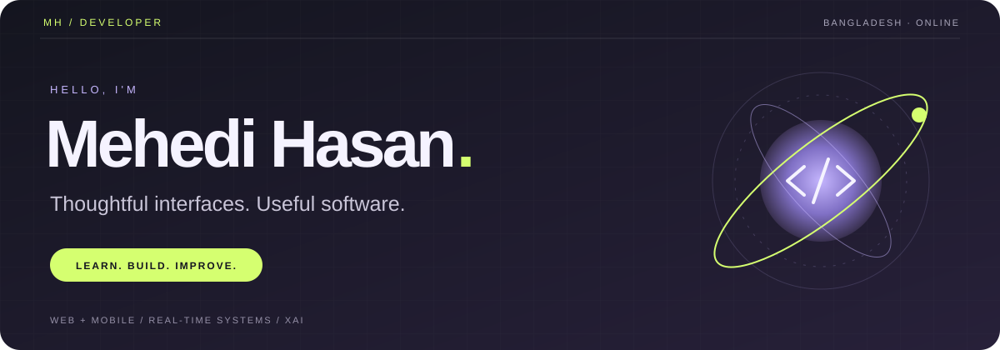
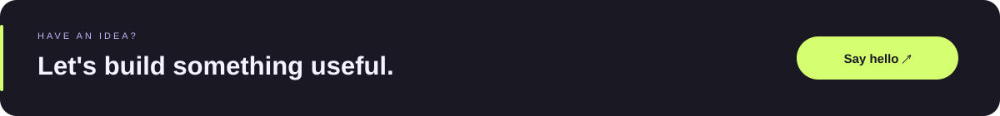

<picture><source media="(prefers-reduced-motion: reduce)" srcset="./assets/header-static.svg"></picture>

**Web & mobile development · Real-time collaboration · Explainable AI**

Building from Bangladesh. Learning by making things that work.

  

 

## A little about me

I'm **Mehedi**, a software developer interested in the space where clear interfaces meet useful engineering. I build web and mobile experiences, explore real-time systems, and study how AI decisions can be made more understandable.

- **Building:** Flowboard, a collaborative whiteboard and real-time editor.
- **Exploring:** explainable AI for intrusion detection and interpretable security analysis.
- **Practicing:** algorithms, problem solving, and the fundamentals behind reliable software.
- **Open to:** practical open-source projects and thoughtful collaboration.

 

## Selected work

<table>
<tr>
<td width="50%" valign="top">

### 01 / Flowboard

**Ideas, together. In real time.**

A collaborative whiteboard with drawing tools, threaded comments, shared boards, and a Three.js arcade.

`TypeScript` · `Next.js` · `Convex` · `Three.js`

[Explore the project →](https://github.com/mehedihasan722/real-time-editor)

</td>
<td width="50%" valign="top">

### 02 / Explainable security

**Understanding the prediction.**

An intrusion-detection research project exploring explainable AI and interpretable security analysis.

`Python` · `Machine learning` · `XAI`

[Explore the research →](https://github.com/mehedihasan722/Thesis-Defense-Project-XAI-ids-Update)

</td>
</tr>
<tr>
<td width="50%" valign="top">

### 03 / File sharing

**A simpler way to share.**

A TypeScript application exploring modern file-sharing workflows and approachable interfaces.

`TypeScript` · `Web application`

[Explore the project →](https://github.com/mehedihasan722/file-sharing-app)

</td>
<td width="50%" valign="top">

### 04 / Design workspace

**Exploring how creative tools work.**

A Figma-inspired project focused on collaborative design interfaces and canvas interactions.

`TypeScript` · `UI development`

[Explore the project →](https://github.com/mehedihasan722/figma-clone)

</td>
</tr>
</table>

 

## My toolkit

Tools I work with and technologies I’m continuing to explore.

### Languages & fundamentals

### Web & mobile

### Data, cloud & tools

 

## A habit of building

<picture>
  <source media="(prefers-color-scheme: dark)" srcset="https://raw.githubusercontent.com/mehedihasan722/mehedihasan722/output/snake-dark.svg">
  <source media="(prefers-color-scheme: light)" srcset="https://raw.githubusercontent.com/mehedihasan722/mehedihasan722/output/snake.svg">
  
</picture>

<a href="https://github.com/mehedihasan722?tab=repositories">Browse repositories</a> &nbsp; / &nbsp; <a href="https://github.com/mehedihasan722?tab=overview">View contribution history</a>

 

## Beyond the editor

Find me around the web, explore my coding profiles, or get in touch.

   

  

**Share my profile:** [github.com/mehedihasan722](https://github.com/mehedihasan722)

 

<a href="mailto:mjimehedi99@gmail.com"><picture><source media="(prefers-reduced-motion: reduce)" srcset="./assets/footer-static.svg"></picture></a>

